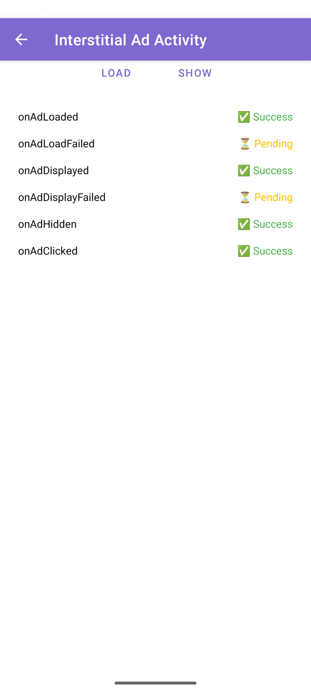

# CloudX Sample App

This is a sample Android application demonstrating the integration of the CloudX SDK for displaying banner and interstitial ads.

## Features

*   **Main Activity:** A starting screen with buttons to navigate to different ad format examples.
*   **Banner Ad Activity:** Demonstrates how to load and display a banner ad and provides a real-time log of `CloudXAdViewListener` events.
*   **Interstitial Ad Activity:** Shows how to load and display a full-screen interstitial ad and provides a real-time log of `CloudXInterstitialListener` events.

## How to Build and Run

1.  Clone the repository.
2.  Open the project in Android Studio.
3.  Sync the project with Gradle files.
4.  Run the `app` configuration on an Android emulator or a physical device.

## Screenshots

**Main Activity**

**Banner Ad Activity**

**Interstitial Ad Activity**

